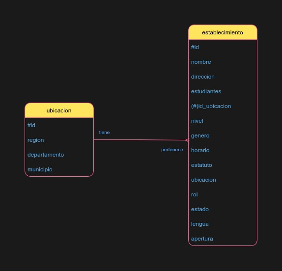
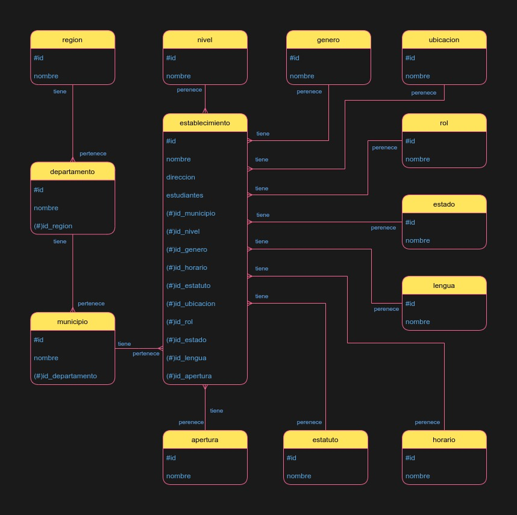

# Manual de Uso

## Modelo conceptual

### Modelo sin normalizar


### Reglas de normalización aplicadas
#### Primera forma normal
Se dividió la entidad ubicación en 3 entidades: región, departamento y municipio, con el fin de evitar duplicidad de datos.

#### Segunda forma normal
No se realizaron modificaciones para conseguir la segunda forma normal, ya que no hay dependencias funcionales completas.

#### Tercera forma normal
Se observaron dependencias funcionales transitivas en la entidad establecimiento, donde los atributos: nivel, genero, horario, estatuto, ubicacion, rol, estado, lengua y apertura dependen del establecimiento, más no de su llave primaria. Por ende, se procedió a crear una entidad de cada uno de estos atributos para evitar repetir datos.

### Modelo normalizado


### Entidades
#### Region
- id: Identificador único
- nombre: Nombre de la región

#### Departamento
- id: Identificador único
- nombre: Nombre del departamento
- id_region: Llave foránea de  la región

#### Municipio
- id: Identificador único
- nombre: Nombre del municipio
- id_departamento: Llave foránea del departamento

#### Establecimiento
- id: Identificador único
- nombre: Nombre del establecimiento
- direccion: Dirección del establecimiento
- estudiantes: Cantidad de estudiantes
- id_municipio: Llave foránea del municipio
- id_nivel: Llave foránea del nivel
- id_genero: Llave foránea del genero
- id_horario: Llave foránea del horario
- id_estatuto: Llave foránea del estatuto
- id_ubicacion: Llave foránea de la ubicación
- id_rol: Llave foránea del rol
- id_estado: Llave foránea del estado
- id_lengua: Llave foránea de la lengua
- id_apertura: Llave foránea de la apertura

#### Nivel
- id: Identificador único
- nombre: Nombre del nivel

#### Genero
- id: Identificador único
- nombre: Nombre de género

#### Horario
- id: Identificador único
- nombre: Nombre del horario

#### Estatuto
- id: Identificador único
- nombre: Nombre del estatuto

#### Ubicacion
- id: Identificador único
- nombre: Nombre de la ubicación

#### Rol
- id: Identificador único
- nombre: Nombre del rol

#### Estado
- id: Identificador único
- nombre: Nombre del estado

#### Lengua
- id: Identificador único
- nombre: Nombre de la lengua

#### Apertura
- id: Identificador único
- nombre: Nombre de la apertura

## Modelo lógico
### Tablas
#### Region
|   id   | nombre        |
| :----: | ------------- |
| **PK** |               |
|   1    | METROPOLITANA |
|   2    | NORTE         |
|   3    | NORORIENTE    |

#### Departamento
|   id   | nombre      | id_region |
| :----: | ----------- | :-------: |
| **PK** |             |  **FK**   |
|   1    | GUATEMALA   |     1     |
|   1    | EL PROGRESO |     3     |

#### Municipio
|   id   | nombre                | id_departamento |
| :----: | --------------------- | :-------------: |
| **PK** |                       |     **FK**      |
|   1    | GUATEMALA             |        1        |
|   2    | SANTA CATARINA PINULA |        1        |

#### Establecimiento
|   id   | nombre                                | direccion      | estudiantes | id_municipio | id_nivel | id_genero | id_horario | id_estatuto | id_ubicacion | id_rol | id_estado | id_lengua | id_apertura |
| :----: | ------------------------------------- | -------------- | ----------- | :----------: | :------: | :-------: | :--------: | :---------: | :----------: | :----: | :-------: | :-------: | :---------: |
| **PK** |                                       |                |             |    **FK**    |  **FK**  |  **FK**   |   **FK**   |   **FK**    |    **FK**    | **FK** |  **FK**   |  **FK**   |   **FK**    |
|   1    | EODP NO.20 'ANTONIO JOSE DE IRISARRI' | 19 CALLE 12-71 | 1           |      1       |    1     |     1     |     1      |      1      |      1       |   1    |     1     |     1     |      1      |
|   1    | EODP NO.21 'GABRIELA MISTRAL'         | 19 CALLE 12-71 | 2           |      1       |    1     |     1     |     1      |      1      |      1       |   1    |     1     |     1     |      1      |

#### Nivel
|   id   | nombre               |
| :----: | -------------------- |
| **PK** |                      |
|   1    | PREPRIMARIA PARVULOS |
|   2    | PRIMARIA DE NIÑOS    |

#### Genero
|   id   | nombre  |
| :----: | ------- |
| **PK** |         |
|   1    | MIXTA   |
|   2    | HOMBRES |

#### Horario
|   id   | nombre     |
| :----: | ---------- |
| **PK** |            |
|   1    | MATUTINA   |
|   2    | VESPERTINA |

#### Estatuto
|   id   | nombre  |
| :----: | ------- |
| **PK** |         |
|   1    | OFICIAL |
|   2    | PRIVADO |

#### Ubicacion
|   id   | nombre |
| :----: | ------ |
| **PK** |        |
|   1    | URBANO |
|   2    | RURAL  |

#### Rol
|   id   | nombre |
| :----: | ------ |
| **PK** |        |
|   1    | PURA   |
|   2    | ANEXA  |

#### Estado
|   id   | nombre                |
| :----: | --------------------- |
| **PK** |                       |
|   1    | ABIERTA               |
|   2    | CERRADA TEMPORALMENTE |

#### Lengua
|   id   | nombre     |
| :----: | ---------- |
| **PK** |            |
|   1    | MONOLINGUE |
|   2    | BILINGUE   |

#### Apertura
|   id   | nombre    |
| :----: | --------- |
| **PK** |           |
|   1    | ANUAL     |
|   2    | SEMESTRAL |

## Modelo físico
Scripts del modelo físico

### DDL
```sql
CREATE TABLE region(
  id INT NOT NULL AUTO_INCREMENT,
  nombre VARCHAR(100),
  PRIMARY KEY(id)
);

CREATE TABLE departamento(
  id INT NOT NULL AUTO_INCREMENT,
  nombre VARCHAR(100),
  id_region INT,
  PRIMARY KEY(id),
  FOREIGN KEY(id_region) REFERENCES region(id)
);

CREATE TABLE municipio(
  id INT NOT NULL AUTO_INCREMENT,
  nombre VARCHAR(100),
  id_departamento INT,
  PRIMARY KEY(id),
  FOREIGN KEY(id_departamento) REFERENCES departamento(id)
);

CREATE TABLE apertura(
  id INT NOT NULL AUTO_INCREMENT,
  nombre VARCHAR(100),
  PRIMARY KEY(id)
);

CREATE TABLE estatuto(
  id INT NOT NULL AUTO_INCREMENT,
  nombre VARCHAR(100),
  PRIMARY KEY(id)
);

CREATE TABLE horario(
  id INT NOT NULL AUTO_INCREMENT,
  nombre VARCHAR(100),
  PRIMARY KEY(id)
);

CREATE TABLE lengua(
  id INT NOT NULL AUTO_INCREMENT,
  nombre VARCHAR(100),
  PRIMARY KEY(id)
);

CREATE TABLE estado(
  id INT NOT NULL AUTO_INCREMENT,
  nombre VARCHAR(100),
  PRIMARY KEY(id)
);

CREATE TABLE rol(
  id INT NOT NULL AUTO_INCREMENT,
  nombre VARCHAR(100),
  PRIMARY KEY(id)
);

CREATE TABLE ubicacion(
  id INT NOT NULL AUTO_INCREMENT,
  nombre VARCHAR(100),
  PRIMARY KEY(id)
);

CREATE TABLE genero(
  id INT NOT NULL AUTO_INCREMENT,
  nombre VARCHAR(100),
  PRIMARY KEY(id)
);

CREATE TABLE nivel(
  id INT NOT NULL AUTO_INCREMENT,
  nombre VARCHAR(100),
  PRIMARY KEY(id)
);

CREATE TABLE establecimiento(
  id INT NOT NULL AUTO_INCREMENT,
  nombre VARCHAR(100),
  direccion VARCHAR(100),
  estudiantes INT,
  id_municipio INT,
  id_nivel INT,
  id_genero INT,
  id_horario INT,
  id_estatuto INT,
  id_ubicacion INT,
  id_rol INT,
  id_estado INT,
  id_lengua INT,
  id_apertura INT,
  PRIMARY KEY(id),
  FOREIGN KEY(id_municipio) REFERENCES municipio(id),
  FOREIGN KEY(id_nivel) REFERENCES nivel(id),
  FOREIGN KEY(id_genero) REFERENCES genero(id),
  FOREIGN KEY(id_horario) REFERENCES horario(id),
  FOREIGN KEY(id_estatuto) REFERENCES estatuto(id),
  FOREIGN KEY(id_ubicacion) REFERENCES ubicacion(id),
  FOREIGN KEY(id_rol) REFERENCES rol(id),
  FOREIGN KEY(id_estado) REFERENCES estado(id),
  FOREIGN KEY(id_lengua) REFERENCES lengua(id),
  FOREIGN KEY(id_apertura) REFERENCES apertura(id)
);
```

### DML
```sql
INSERT INTO region VALUES
(null, 'METROPOLITANA'),
(null, 'NORTE'),
(null, 'NORORIENTE'),
(null, 'SURORIENTE'),
(null, 'CENTRAL'),
(null, 'SUROCCIDENTE'),
(null, 'NOROCCIDENTE'),
(null, 'PETEN');

INSERT INTO departamento
SELECT DISTINCT null, nombre_dep, null FROM massive
WHERE nombre_dep!='';

UPDATE departamento SET id_region=(
  SELECT id FROM region WHERE nombre='METROPOLITANA'
) WHERE nombre IN ('GUATEMALA');

UPDATE departamento SET id_region=(
  SELECT id FROM region WHERE nombre='NORTE'
) WHERE nombre IN ('ALTA VERAPAZ', 'BAJA VERAPAZ');

UPDATE departamento SET id_region=(
  SELECT id FROM region WHERE nombre='NORORIENTE'
) WHERE nombre IN ('IZABAL', 'CHIQUIMULA', 'ZACAPA', 'EL PROGRESO');

UPDATE departamento SET id_region=(
  SELECT id FROM region WHERE nombre='SURORIENTE'
) WHERE nombre IN ('JUTIAPA', 'JALAPA', 'SANTA ROSA');

UPDATE departamento SET id_region=(
  SELECT id FROM region WHERE nombre='CENTRAL'
) WHERE nombre IN ('CHIMALTENANGO', 'SACATEPEQUEZ', 'ESCUINTLA');

UPDATE departamento SET id_region=(
  SELECT id FROM region WHERE nombre='SUROCCIDENTE'
) WHERE nombre IN ('SAN MARCOS', 'QUETZALTENANGO', 'TOTONICAPAN', 'SOLOLA', 'RETALHULEU', 'SUCHITEPEQUEZ');

UPDATE departamento SET id_region=(
  SELECT id FROM region WHERE nombre='NOROCCIDENTE'
) WHERE nombre IN ('HUEHUETENANGO', 'QUICHE');

UPDATE departamento SET id_region=(
  SELECT id FROM region WHERE nombre='PETEN'
) WHERE nombre IN ('PETEN');

INSERT INTO departamento
SELECT DISTINCT null, nombre_dep FROM massive
WHERE nombre_dep!='';

INSERT INTO municipio
SELECT DISTINCT null, m.nombre_mun, d.id FROM massive m
INNER JOIN departamento d ON d.nombre=m.nombre_dep
WHERE nombre_mun!='';

INSERT INTO apertura
SELECT DISTINCT null, apertura FROM massive m
WHERE apertura!='';

INSERT INTO estatuto
SELECT DISTINCT null, estatuto_a FROM massive m
WHERE estatuto_a!='';

INSERT INTO horario
SELECT DISTINCT null, horarios FROM massive m
WHERE horarios!='';

INSERT INTO lengua
SELECT DISTINCT null, lengua FROM massive m
WHERE lengua!='';

INSERT INTO estado
SELECT DISTINCT null, estado FROM massive m
WHERE estado!='';

INSERT INTO rol
SELECT DISTINCT null, role FROM massive m
WHERE role!='';

INSERT INTO ubicacion
SELECT DISTINCT null, ubicuacion FROM massive m
WHERE ubicuacion!='';

INSERT INTO genero
SELECT DISTINCT null, genero FROM massive m
WHERE genero!='';

INSERT INTO nivel
SELECT DISTINCT null, nivel FROM massive m
WHERE nivel!='';

INSERT INTO establecimiento
SELECT DISTINCT null, m.nombre, m.direccion, CAST(m.latlones_2 AS UNSIGNED),
mu.id, n.id, g.id, h.id, e.id, u.id, r.id, es.id, l.id, a.id FROM massive m
INNER JOIN municipio mu ON mu.nombre=m.nombre_mun
INNER JOIN nivel n ON n.nombre=m.nivel
INNER JOIN genero g ON g.nombre=m.genero
INNER JOIN horario h ON h.nombre=m.horarios
INNER JOIN estatuto e ON e.nombre=m.estatuto_a
INNER JOIN ubicacion u ON u.nombre=m.ubicuacion
INNER JOIN rol r ON r.nombre=m.role
INNER JOIN estado es ON es.nombre=m.estado
INNER JOIN lengua l ON l.nombre=m.lengua
INNER JOIN apertura a ON a.nombre=m.apertura
WHERE m.nombre!='' AND m.direccion!='';
```

### Carga masiva de datos
```sql
CREATE TABLE massive(
  gid VARCHAR(100),
  establecim VARCHAR(100),
  nombre VARCHAR(100),
  latlones_2 VARCHAR(100),
  latlones_3 VARCHAR(100),
  departamen VARCHAR(100),
  escuela VARCHAR(100),
  x_geo VARCHAR(100),
  y_geo VARCHAR(100),
  nombre_dep VARCHAR(100),
  nombre_mun VARCHAR(100),
  nivel VARCHAR(100),
  direccion VARCHAR(100),
  telefono VARCHAR(100),
  genero VARCHAR(100),
  horarios VARCHAR(100),
  estatuto_a VARCHAR(100),
  ubicuacion VARCHAR(100),
  role VARCHAR(100),
  estado VARCHAR(100),
  lengua VARCHAR(100),
  apertura VARCHAR(100)
);

LOAD DATA LOCAL INFILE 'file.csv' INTO TABLE massive FIELDS TERMINATED BY ',' OPTIONALLY ENCLOSED BY '"' IGNORE 1 ROWS;
```

## Consultas solicitadas
```sql
-- 1. Desplegar el porcentaje de establecimientos por cada nivel educativo
SELECT
  n.nombre `nivel educativo`,
  count(e.id) /(
    SELECT
      count(e.id) total
    FROM
      establecimiento e
  ) * 100 `porcentaje establecimientos`
FROM
  establecimiento e
  INNER JOIN nivel n ON n.id = e.id_nivel
GROUP BY
  `nivel educativo`;

-- 2. Desplegar los establecimientos en el sur del país
SELECT
  e.nombre establecimiento
FROM
  establecimiento e
  INNER JOIN municipio m ON m.id = e.id_municipio
  INNER JOIN departamento d ON d.id = m.id_departamento
WHERE
  d.id_region IN (
    SELECT
      id
    FROM
      region
    WHERE
      nombre IN ('SUROCCIDENTE', 'SURORIENTE')
  );

-- 3. Desplegar un Top 10 de Municipios con menos establecimientos
SELECT
  m.nombre municipio,
  count(*) establecimientos
FROM
  municipio m
  INNER JOIN establecimiento e ON e.id_municipio = m.id
GROUP BY
  municipio
ORDER BY
  establecimientos
LIMIT
  10;

-- 4. Desplegar los establecimientos con “BARRIOS” en su nombre que no estén en la capital
SELECT
  e.nombre establecimiento,
  m.nombre municipio
FROM
  establecimiento e
  INNER JOIN municipio m ON m.id = e.id_municipio
WHERE
  e.nombre LIKE '%BARRIOS%'
  AND m.nombre != 'GUATEMALA';

-- 5. Desplegar el total de establecimientos en los municipios agrupados por su letra inicial, es decir, agrupar los municipios con A luego calcular el número de establecimientos, lo mismo para los que inicien con B y así sucesivamente
SELECT
  substr(m.nombre, 1, 1) letra,
  count(e.id) establecimientos
FROM
  municipio m
  INNER JOIN establecimiento e ON e.id_municipio = m.id
GROUP BY
  letra;

-- 6. Desplegar los municipios con su departamento los cuales contengan al menos un establecimiento urbano
SELECT
  m.nombre municipio,
  count(e.id) `establecimientos urbanos`
FROM
  establecimiento e
  INNER JOIN municipio m ON m.id = e.id_municipio
  INNER JOIN departamento d ON d.id = m.id_departamento
WHERE
  e.id_ubicacion =(
    SELECT
      id
    FROM
      ubicacion
    WHERE
      nombre = 'URBANO'
  )
GROUP BY
  municipio
HAVING
  `establecimientos urbanos` >= 1;

-- 7. Mostrar los departamentos en donde haya más establecimientos para mujeres que para hombres
SELECT
  d.nombre departamento,
  s1.cantidad mujeres,
  s2.cantidad hombres
FROM
  departamento d
  INNER JOIN (
    SELECT
      d.id id,
      count(e.id) cantidad
    FROM
      departamento d
      INNER JOIN municipio m ON m.id_departamento = d.id
      INNER JOIN establecimiento e ON e.id_municipio = m.id
    WHERE
      e.id_genero =(
        SELECT
          id
        FROM
          genero
        WHERE
          nombre = 'MUJERES'
      )
    GROUP BY
      id
  ) s1 ON s1.id = d.id
  INNER JOIN (
    SELECT
      d.id id,
      count(e.id) cantidad
    FROM
      departamento d
      INNER JOIN municipio m ON m.id_departamento = d.id
      INNER JOIN establecimiento e ON e.id_municipio = m.id
    WHERE
      e.id_genero =(
        SELECT
          id
        FROM
          genero
        WHERE
          nombre = 'HOMBRES'
      )
    GROUP BY
      id
  ) s2 ON s2.id = d.id
WHERE
  s1.cantidad > s2.cantidad;

-- 8. Desplegar el porcentaje de establecimientos rurales y urbanas de los departamentos en donde haya más establecimientos rurales
SELECT
  d.nombre departamento,
  s1.cantidad `e. rurales`,
  s2.cantidad `e. urbanos`,
  (s1.cantidad / (s1.cantidad + s2.cantidad)) * 100 `p. e. rurales`,
  (s2.cantidad / (s1.cantidad + s2.cantidad)) * 100 `p. e. urbanos`
FROM
  departamento d
  INNER JOIN (
    SELECT
      d.id id,
      count(e.id) cantidad
    FROM
      departamento d
      INNER JOIN municipio m ON m.id_departamento = d.id
      INNER JOIN establecimiento e ON e.id_municipio = m.id
    WHERE
      e.id_ubicacion =(
        SELECT
          id
        FROM
          ubicacion
        WHERE
          nombre = 'RURAL'
      )
    GROUP BY
      id
  ) s1 ON s1.id = d.id
  INNER JOIN (
    SELECT
      d.id id,
      count(e.id) cantidad
    FROM
      departamento d
      INNER JOIN municipio m ON m.id_departamento = d.id
      INNER JOIN establecimiento e ON e.id_municipio = m.id
    WHERE
      e.id_ubicacion =(
        SELECT
          id
        FROM
          ubicacion
        WHERE
          nombre = 'URBANO'
      )
    GROUP BY
      id
  ) s2 ON s2.id = d.id;

-- 9. Mostrar el porcentaje de establecimientos por Jornada
SELECT
  h.nombre jornada,
  count(e.id) /(
    SELECT
      count(e.id) total
    FROM
      establecimiento e
  ) * 100 `porcentaje establecimientos`
FROM
  establecimiento e
  INNER JOIN horario h ON h.id = e.id_horario
GROUP BY
  jornada;

-- 10. Desplegar los establecimientos que tengan más estudiantes que el promedio
SELECT
  nombre,
  estudiantes
FROM
  establecimiento
HAVING
  estudiantes > (
    SELECT
      AVG(estudiantes)
    FROM
      establecimiento
  )
ORDER BY
  estudiantes;

-- 11. Desplegar la cantidad estudiantes que hay por región (Norte, Nor-Occidente, NorOriente, Sur-Occidente, Sur-Oriente, Central, Metropolitana, Petén)
SELECT
  r.nombre region,
  sum(e.id) estudiantes
FROM
  region r
  INNER JOIN departamento d ON d.id_region = r.id
  INNER JOIN municipio m ON m.id_departamento = d.id
  INNER JOIN establecimiento e ON e.id_municipio = m.id
GROUP BY
  region;

-- 12. Desplegar los 2 establecimientos con más estudiantes de cada departamento
SELECT
  d.nombre departamento,
  e.nombre establecimiento,
  e.estudiantes estudiantes
FROM
  departamento d
  INNER JOIN municipio m ON m.id_departamento = d.id
  INNER JOIN establecimiento e ON e.id_municipio = m.id
GROUP BY
  departamento
ORDER BY
  estudiantes DESC;
select
  *
from
  establecimiento;
```
